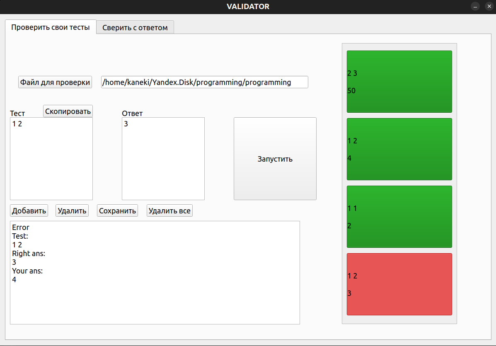

# Валидатор для олимпиад по программиорванию.

### Базовый функионал
* Два режима:
  * Загрузка двух решений и генератора тестов для валидации.
  * Загрузка одного решения и написание тестов с ответами для валидации.
* Умение работать и со скриптами .py и с бинарями плюсов. 
* Вывод или указание на неработающий тест с возможностью скопировать.
* UI

### Дополнительный функцонал
* Консольный интерфейс
* Для консольного нужен будет парсинг отдельного файла с тестами.
* Выбор интерпретатора для интерпретируемого языка (т.е. поддержка не только питона).
* Сохранение настроек при закрытии приложения (выбранные файлы, тесты, интерпретаторы).
* Поддержка сочетаний клавиш

## Диаграмма классов

**Window** - Создает окно с двумя вкладками

**Check** - первая вкладка, предназначена для проверки своих тестов

**Validate** - вторая влкадка, предназначена для сравнения своего решения с эталонным.

**Core** - осущесвтвляет работу по запуску файлов, получению и сравнению ответов.

## Скриншот программы
